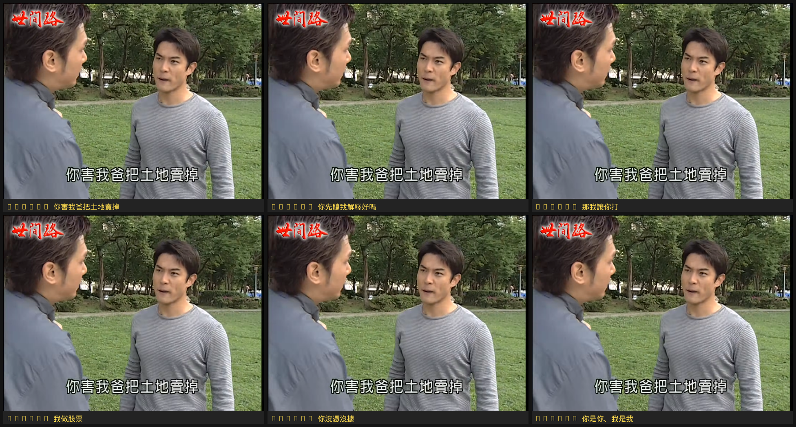

# yt-hardcoded-subtitle-extractor

A [Claude Cowork](https://claude.ai/download) skill that extracts hardcoded (burned-in) subtitles from YouTube videos as text and saves the corresponding audio clips as files.

Validated on Hokkien / Taiwanese drama content with Traditional Chinese subtitles, but works on any YouTube video with burned-in text.

## What it does

1. Opens the YouTube video in Chrome and scans frames at regular intervals
2. Reads subtitle text from each frame using Claude's vision OCR
3. Records the audio for each subtitle segment using the Web Audio API
4. Saves a CSV index of all subtitles + timestamps alongside the `.webm` audio clips

## Requirements

- **[Claude Cowork](https://claude.ai/download)** (desktop app)
- **[Claude in Chrome](https://chromewebstore.google.com/detail/claude-in-chrome/gdjgalopbniafdepijdlkgknkgocbgfc)** browser extension — the skill drives the YouTube player through Chrome to capture frames and record audio

## Installation

1. Download [`yt-hardcoded-subtitle-extractor.skill`](https://github.com/changtimwu/yt-hardcoded-subtitle-extractor/releases) from Releases, **or** clone this repo and zip the folder with a `.skill` extension yourself:
   ```bash
   git clone https://github.com/changtimwu/yt-hardcoded-subtitle-extractor.git
   cd ..
   zip -r yt-hardcoded-subtitle-extractor.skill yt-hardcoded-subtitle-extractor/
   ```
2. Open Claude Cowork → **Settings → Skills → Install from file** and select the `.skill` file.
3. Make sure the **Claude in Chrome** extension is active in your browser.

## Usage

Just paste a YouTube URL into Claude Cowork:

> `https://www.youtube.com/watch?v=GlNFQkMwzAs`

Claude will ask how much of the video to process, then run the full pipeline and save the subtitle CSV and audio clips to your selected workspace folder.

## Output

```
your-workspace/
├── subtitles_<episode>.csv       ← timestamp, subtitle text, audio filename
└── audio_clips/
    ├── subtitle_195s_你害我爸把土地賣掉.webm
    ├── subtitle_198s_你先聽我解釋好嗎.webm
    └── ...
```

Each audio clip is ~3 seconds, Opus-encoded in a `.webm` container (~48 KB each).

## Example

Six subtitle frames captured from 世間路 EP40 (a Hokkien/Taiwanese drama). Each cell shows the burned-in Traditional Chinese subtitle text at the bottom of the frame, along with the timestamp and text label.



The extracted subtitle index (`subtitles_ep40_poc.csv`) for the same scene:

| timestamp_s | subtitle_text | notes |
|-------------|---------------|-------|
| 195 | 你害我爸把土地賣掉 | You caused my father to sell the land |
| 198 | 你先聽我解釋，好嗎 | Please listen to my explanation first |
| 206 | 那我讓你打 | Then I'll let you hit me |
| 238 | 我做股票 | I traded stocks |
| 242 | 你沒憑沒據 | You have no proof/evidence |
| 258 | 你是你、我是我 | You are you and I am I |
